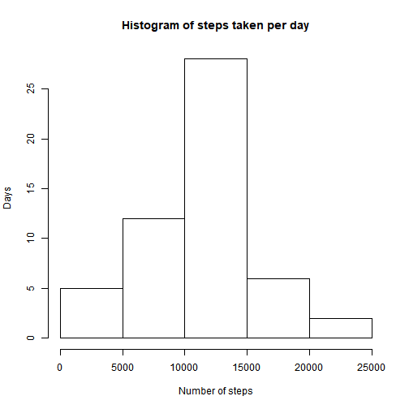
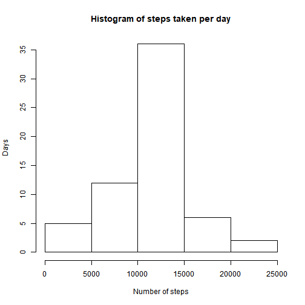

# Peer-graded Assignment: Course Project 1
# Coursera Reproducible Research Week 2

The code assumes that the unzipped analysis file is present in your working directory.

## Loading and preprocessing the data
So let's read the data:

```r
rawData <- read.csv("activity.csv")
```
## What is mean total number of steps taken per day?
Calculating the total number of steps taken per day:

```r
sum(rawData$steps, na.rm=T)
```

```
## [1] 570608
```
Let's create a histogram of the total number of steps taken each day:

```r
stepsPerDay <- aggregate(steps ~ date, rawData, sum)
hist(stepsPerDay$steps, xlab = "Number of steps", ylab = "Days", main="Histogram of steps taken per day")
```



Checking the mean and median number of steps taken per day:

```r
mean(stepsPerDay$steps)
```

```
## [1] 10766.19
```

```r
median(stepsPerDay$steps)
```

```
## [1] 10765
```
## What is the average daily activity pattern?
Creating a time series plot of the 5-minute interval and the average number of steps taken:

```r
meanStepsPerInterval <- aggregate(steps ~ interval, rawData, mean)
plot(meanStepsPerInterval, type="l")
```


Which 5-minute interval contains the maximum average number of steps across all days?

```r
with(meanStepsPerInterval, meanStepsPerInterval[steps == max(steps),"interval"])
```

```
## [1] 835
```
## Imputing missing values
How many missing values are there in our dataset?

```r
nrow(rawData[is.na(rawData$steps),])
```

```
## [1] 2304
```
Replacing the missing values with the average for the respective interval

```r
require(dplyr)
```

```
## Loading required package: dplyr
```

```
## 
## Attaching package: 'dplyr'
```

```
## The following objects are masked from 'package:stats':
## 
##     filter, lag
```

```
## The following objects are masked from 'package:base':
## 
##     intersect, setdiff, setequal, union
```

```r
tmp <- rawData %>% group_by(interval) %>% mutate_each(funs(mean=mean(., na.rm=T)), steps)
imputedData = rawData
imputedData[is.na(imputedData$steps),"steps"] <- tmp[is.na(tmp$steps),"mean"]
```
Let's create a histogram of the total number of steps taken each day on the imputed data

```r
stepsPerDay <- aggregate(steps ~ date, imputedData, sum)
hist(stepsPerDay$steps, xlab = "Number of steps", ylab = "Days", main="Histogram of steps taken per day")
```



Checking the mean and median number of steps taken per day on imputed dataset:

```r
mean(stepsPerDay$steps)
```

```
## [1] 10766.19
```

```r
median(stepsPerDay$steps)
```

```
## [1] 10766.19
```
Comparing these with the values calculated above on the original dataset, we can see that the medium has not change but the median has been increased a bit.

## Are there differences in activity patterns between weekdays and weekends?
Let's create a factor with the levels "weekend" and "weekday" based on the date column:

```r
imputedData$dayType <- ifelse(weekdays(as.Date(imputedData$date)) %in% c("Saturday", "Sunday"), "weekend", "weekday")
```
Finally we create a panel plot to compare the average number of steps taken on weekdays and weekends:

```r
require(lattice)
```

```
## Loading required package: lattice
```

```r
stepsPerDay <- aggregate(steps ~ dayType + interval, imputedData , mean)
xyplot(steps ~ interval | dayType, data = stepsPerDay, layout = c(1, 2), type="l", xlab = "Interval", ylab = "Number of steps")
```


